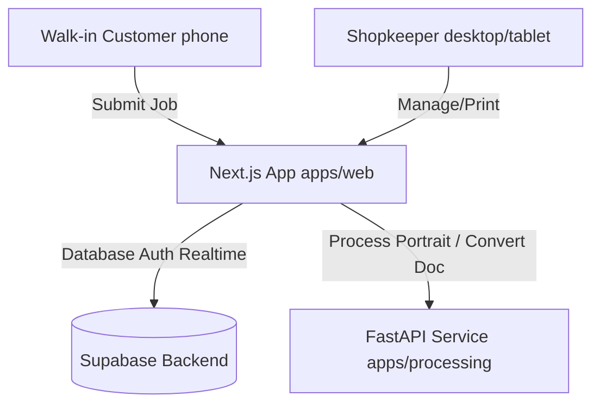

# Project Status: Print Sathi

**Last Updated:** 2026-06-09
**Current Phase:** Phase 1A — Passport Photo Generator (Local Implementation Complete, Pending Verification & Deployment)

---

## 📊 Summary of Current Status

Print Sathi is in active development. All foundation layers (Phase 0) have been fully configured and committed. The local implementation of **Phase 1A (Passport Photo Auto Generator)** has been built on both the Next.js frontend and Python FastAPI backend, but it is currently uncommitted and pending full verification and cloud deployment.

### System Architecture Status

---

## 🛠️ Monorepo Component Status

### 1. Web Portal (`apps/web/`)
* **Framework:** Next.js 14 (App Router) + TypeScript + TailwindCSS + shadcn/ui.
* **Auth:** Supabase Auth with custom middleware session synchronization and route guarding (`/login`, `/dashboard/*`, `/admin/*`).
* **Onboarding:** Fully functioning wizard that captures shop details, area, contact number, and sets up custom rate cards.
* **Passport Photo UI:** Fully implemented at `/dashboard/passport`. Features a drag-and-drop file uploader, size customizer, background color compositor, A4 Canvas sheet preview, and usage tracking.

### 2. Processing Service (`apps/processing/`)
* **Framework:** Python FastAPI.
* **Uploader helpers:** OpenCV + PIL integrations.
* **Image Processing (Phase 1A):** Background removal using `rembg` (u2net model) and automated face detection using Haar Cascade classifiers, with automated cropping to standard passport framing proportions.
* **Dependencies:** Configured in `requirements.txt` (FastAPI, uvicorn, pillow, rembg, opencv-python-headless, pillow-heif, numpy).

### 3. Database Layer (`supabase/`)
* **Instance:** Connected to Supabase development database.
* **Schema (0000_init_schema.sql):** Implemented tables for `shops`, `rate_cards`, `jobs`, `job_items`, `job_status_log`, `usage_logs`, `rate_limits`, `word_pool`, and `admin_users`.
* **Security (0001_rls_policies.sql):** Row Level Security (RLS) policies set up for multi-tenant isolation.
* **Fixes (0002_schema_fixes.sql):** Contains updates for timezone-safe immutable word token functions, flexible JSONB job settings, and audit schema changes.

---

## 📦 File Reference Links

* **State Trackers:**
  * [PROGRESS.md](file:///media/bhavya/backup%20and%20etc/Project/Printo_/PROGRESS.md)
  * [CONTEXT.md](file:///media/bhavya/backup%20and%20etc/Project/Printo_/CONTEXT.md)
  * [COMMITS.md](file:///media/bhavya/backup%20and%20etc/Project/Printo_/COMMITS.md)
* **Product Specifications:**
  * [PrintShop_PRD_v1.md](file:///media/bhavya/backup%20and%20etc/Project/Printo_/PrintShop_PRD_v1.md)
  * [print-shop-automation-platform.md](file:///media/bhavya/backup%20and%20etc/Project/Printo_/print-shop-automation-platform.md)
* **FastAPI Processing Code:**
  * [main.py](file:///media/bhavya/backup%20and%20etc/Project/Printo_/apps/processing/main.py)
  * [requirements.txt](file:///media/bhavya/backup%20and%20etc/Project/Printo_/apps/processing/requirements.txt)
* **Next.js Passport Code:**
  * [Passport Page](file:///media/bhavya/backup%20and%20etc/Project/Printo_/apps/web/src/app/dashboard/passport/page.tsx)
  * [A4SheetPreview.tsx](file:///media/bhavya/backup%20and%20etc/Project/Printo_/apps/web/src/components/passport/A4SheetPreview.tsx)
  * [FileDropzone.tsx](file:///media/bhavya/backup%20and%20etc/Project/Printo_/apps/web/src/components/passport/FileDropzone.tsx)
  * [PassportConfig.tsx](file:///media/bhavya/backup%20and%20etc/Project/Printo_/apps/web/src/components/passport/PassportConfig.tsx)
  * [Usage Logging API Route](file:///media/bhavya/backup%20and%20etc/Project/Printo_/apps/web/src/app/api/usage/passport/route.ts)
